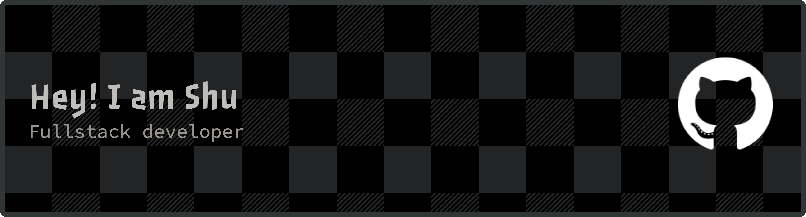

<h1 align="center">Hi 👋, I am Shu!</h1>

  

- 🌱 I’m currently learning **Full-Stack Development, Cybersecurity, and Cloud Computing**
- 👨‍💻 All of my projects are available at
  [https://luo-s.github.io/](https://luo-s.github.io/)
- 💬 Ask me about **Python, Javascript, and Data Structure and Algorithms**
- 📫 How to reach me **luo.s@outlook.com**

<h3 align="left">Connect with me:</h3>

  

<h3 align="left">Languages and Tools:</h3>

    <a 
    href="https://www.python.org/" 
    target="_blank" 
    rel="noreferrer">
    
    
  </a>
  <!--  -->
  <!--  -->
  <!--  -->
  
  
    
  
  
  <!--     -->
  
  
  
  <!--     -->
  
  
  
  
  <!--  -->
  <!--  -->
  <!-- 
  
  
   -->

  

  &nbsp;

  

